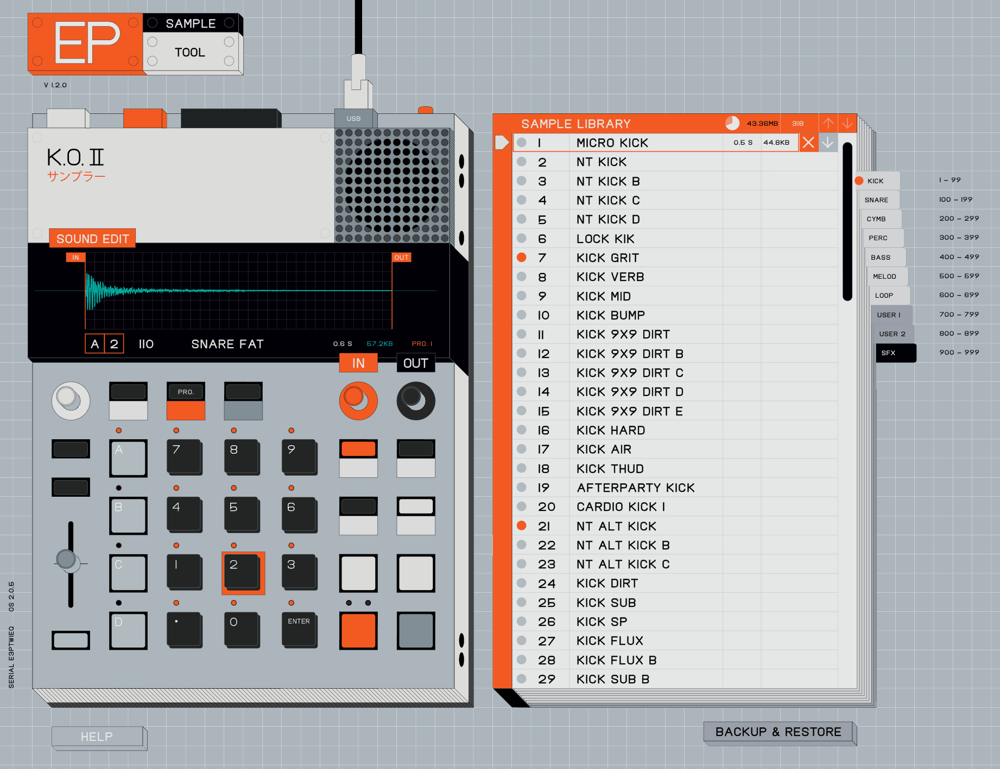

# KO 2

# Midi Reference
https://teenage.engineering/guides/ep-133/system#14.1-midi-refrence

# Features

SAMPLING FREQUENCY: 46 kHz / 16-bit
 internal signal chain: 32-bit
 999 sample slots
 128 MB memory
 preset samples
 high resolution sequencer
 resampling for patterns and sounds
 song mode with 9.801 bars max. length
 note-triggered sidechain
 6 built-in master FX and 12 punch-in fx
 fader and pressure sensitive pads
 twelve stereo voices, sixteen mono
 supports multiple sample rates
 runs on 4x AAA batteries with the option to be powered via usb-c

MIDI input and output
 TRS type A, MMA compliant
